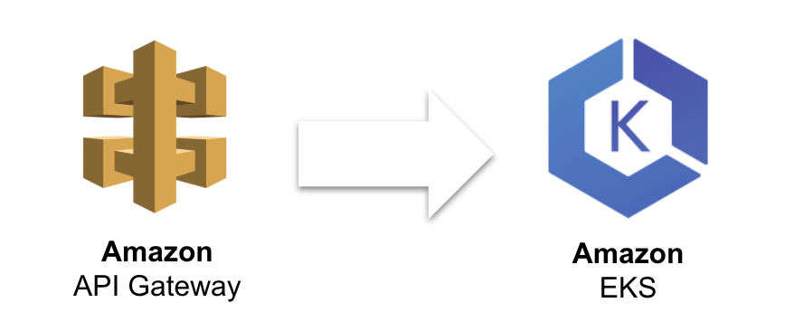
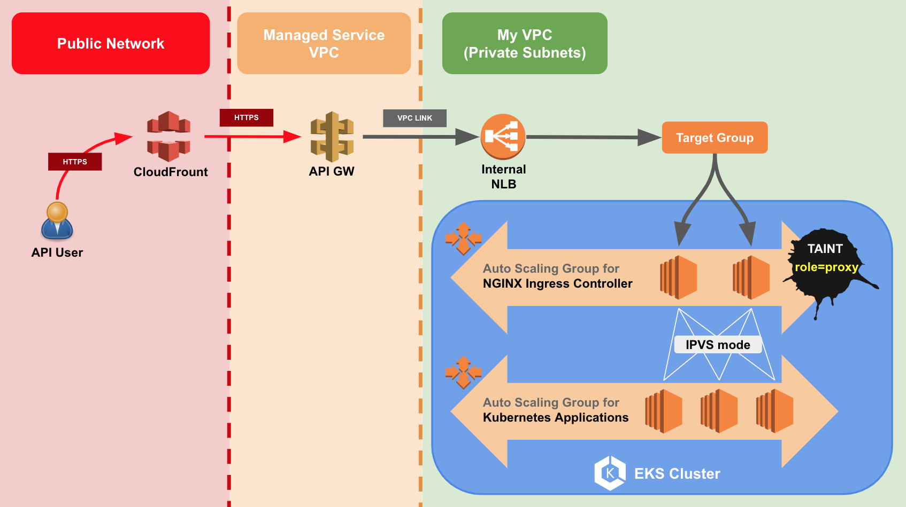

There might be some reasons you want to integrating AWS API Gateway with EKS:
1. Existing Applications which running on EC2 or Lambda exposing APIs via API Gateway, and now you want to put them into Kubernetes.
2. You want to leverage the features of API Gateway to manage your API users instead of exposing your kubernetes services by ingress directly.

### Architecture

Thanks to [this Tweet](https://twitter.com/pahudnet/status/1030628314044452865) by [Pahud Hsieh](https://twitter.com/pahudnet). I use almost the same architecture to integrate EKS with API Gateway and it works well. To better understand how and why I set it up, I will address some details of performance tuning in this architecture.

Focal Points:
- Place NLB and EKS worker node instances in the private subnets. 
- Two worker node groups, one for nginx ingress controller only.
- Setup Linux Kernel parameters for high number of concurrent connections.
- Setup NGINX ingress controller by Helm.

### Everything in the Private Subnets

Except API Gateway and Cloud Front which are not managed by you.

### Two Worker Node Groups