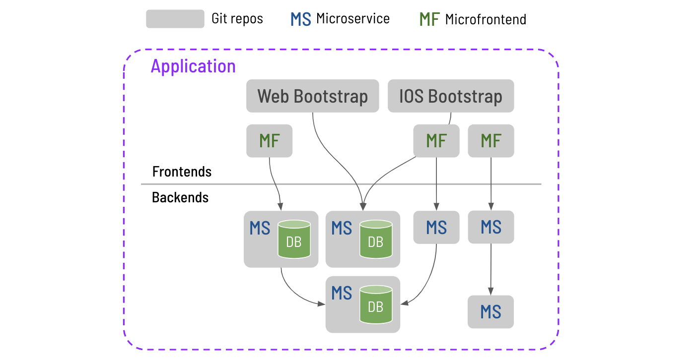

A good source code template dominates all training sessions.
Especially for microservices architecture, you might have more than 10 git repos to form a complete application.

## Outline

* [Overview Of A Microservices Application](#OverviewOfAMicroservicesApplication)

## Overview Of A Microservices Application

