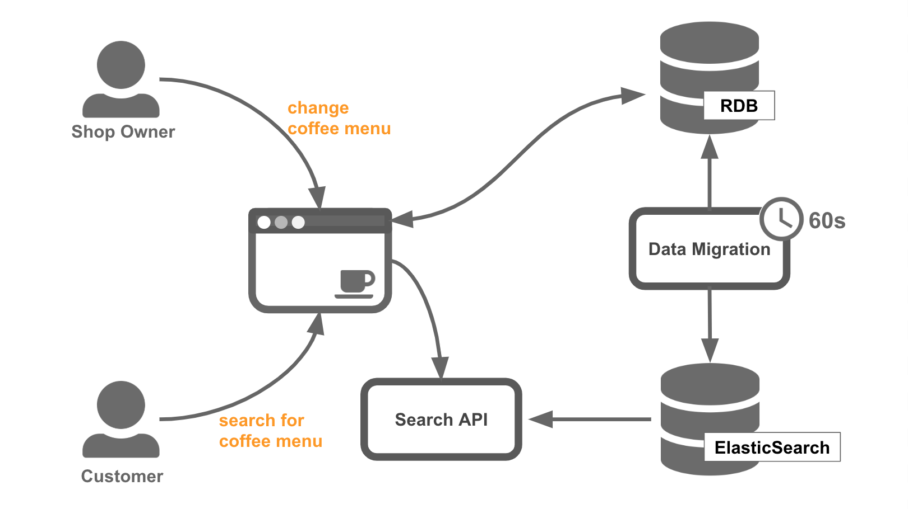
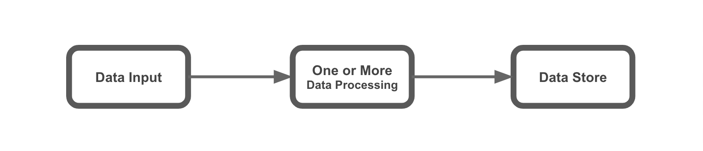

要改善既有系統（Legacy System）一直以來都不是一件容易的事情，尤其是當面臨要改動整體架構時，需要耗費的時間和人力成本往往讓老闆無法輕易買單。因此，如何評估既有系統並明確指出為什麼要進行改善，以及新的系統架構要如何設計才能面對更大的挑戰，是非常重要的。本篇文章將以 [SRE 課程](https://www.coursera.org/learn/site-reliability-engineering-slos/) 中的評估方法作為主軸進行系統評估，結合 [從零開始學架構](https://www.tenlong.com.tw/products/9787121347917) 和 [大規模數據處理實戰](https://time.geekbang.org/column/intro/167) 兩本書中的知識，總結出一套通用且不會過於複雜的系統改善技巧。

## 大綱

* [學習案例介紹](#學習案例介紹)
    - [案例：轉轉咖啡屋](#案例轉轉咖啡屋)
    - [從單體到微服務](#從單體到微服務)
    - [新的挑戰：更大的規模](#新的挑戰更大的規模)
* [系統評估](#系統評估)
    1. [畫出數據流](#1-畫出數據流)
    2. [標示批處理，流處理](#2-標示批處理流處理)
    3. [定義服務水平指標](#3-定義服務水平指標)
    4. 標示 SLI Menu，Request / Response or Data Processing or Data Store
* 系統改善設計
    - 選擇合適的數據工作劉模式

## 學習案例介紹

[從零開始學架構](https://www.tenlong.com.tw/products/9787121347917) 中提到的架構設計三原則：合適、簡單、演化。你不需要在一開始就設計一個技術領先於業界的系統，正所謂『將軍難打無兵之仗』，一開始就投入大量的人力與時間在開發一個高可用、高乘載的系統卻沒有半個使用者，是一點意義也沒有的。所以，設計不良的舊有系統（Legacy System）存在於成功的企業中是常見、正常的狀況。畢竟往往正是因為有了這些符合成本且滿足初期使用者需求的舊有系統，才成就了所謂的成功企業。

### 案例：轉轉咖啡屋

轉轉咖啡屋是一個虛擬的咖啡廳開店平台，提供每一個註冊店家可以在轉轉咖啡屋上開一家屬於自己的咖啡店，並有咖啡配送員幫你將新鮮的咖啡送給消費者。一開始，轉轉咖啡屋做了一個簡單的網站，消費者端有瀏覽店家、咖啡菜單查詢、下單購買、搜尋所有店家菜單等功能。店家端有更新菜單、通知配送員等功能。這個網站使用了單體 + RDBMS 的架構做成如下圖示。過沒多久，轉轉咖啡屋使用者人數一飛沖天，店家數也即將破百。由於搜尋所有店家菜單功能依賴 SQL 查詢關聯式資料庫，效率十分低落，隨著每秒查詢量增加，不但搜尋的速度變慢，還造成 RDBMS 過載，連帶影響到其他功能。

### 從單體到微服務

轉轉咖啡屋唯一的工程師在時間壓力下，決定先將搜尋所有店家菜單功能獨立出來，做成第一個微服務，並使用 [ElasticSearch](https://www.elastic.co/products/elasticsearch) 作為搜尋引擎，改善搜尋效率，並寫了一隻同步程式，每分鐘會將更新資料從 RDB 同步到 ElasticSearch。

### 新的挑戰：更大的規模

在拆分咖啡搜尋服務之後，解決了搜尋效率問題以及降低了搜尋功能與主要功能之間互相影響的程度。當每秒搜尋次數增加時，也可以單獨的擴充咖啡搜尋服務來應付。

一年過去了，轉轉咖啡屋的店家數量破萬，使用者人數更不用說。由於穩定獲利，轉轉咖啡屋聘請了更多的工程師，也成立了獨立的 SRE 團隊。

此時，咖啡搜尋服務開始出現了一些客戶抱怨，例如：

- 已經下架的咖啡出現在搜尋結果當中。
- 搜尋出現的咖啡價格與實際販售的不一致。

原來，由於個人咖啡店的特色是每個人都可以少量販售，隨時修改咖啡菜單和可販售數量。然而資料是由 RDB 經由中間程式同步到 ElasticSearch 的，隨著店家數量變多，資料量變大，中間同步的時間也漸漸地不斷拉長，導致搜尋結果資訊落差。這些資訊落差，已經嚴重的影響到消費者體驗了。

對於轉轉咖啡屋的 SRE 團隊來說，咖啡搜尋服務這個既有系統，該如何去分析並解決這個問題呢？

## 系統評估

好的，接下來終於可以進入我們今天的主題了。第一步是要對系統進行評估，評估的方法採用 [SRE 服務水平指標](https://www.coursera.org/learn/site-reliability-engineering-slos/home/week/2)（Service Level Indicators, SLIs）的理論，藉由找出關鍵 SLIs 指標，來數據化使用者對於系統的滿意程度。根據 [The properties of good SLI metrics
](https://www.coursera.org/learn/site-reliability-engineering-slos/lecture/pgyZk/the-properties-of-good-sli-metrics) 裡面提到，一個好的 SLI 指標必須真實且直接反應出使用者感受。意即我們可以從一個數值區間為 0%~100% 的 SLI 指標中得知，目前系統某個操作的性能與狀態，是否造成使用者不好的體驗，影響程度與範圍多大。甚至我們可以從數字中換算出客服處理時間，[服務水平指標](https://www.coursera.org/learn/site-reliability-engineering-slos/home/week/2) 越差，代表公司必須付出更多的客服成本，且降低使用者對產品品質的信心。

有了這些數據，我們就可以在改善項目成本與不進行改善所付出的代價之間進行取捨。

通常一個服務根據功能項目多寡和性質，可以定義出多種不同的 SLIs 指標。找出可供改善系統參考的 SLIs 並不容易，在這邊分享一套我自己的做法，供大家參考。

### 1. 畫出數據流

首先，我們要從既有系統當中，辨識出 __數據流__。數據流是新數據進入到系統，經過系統處理到儲存的路徑。簡單來說，我們可以從資料最終的儲存位置反推回去到資料來源，即是一個數據流。如果數據最終的流動方向不是系統資料存儲，這邊我們就不把它當成一個數據流。例如，從資料庫調閱店家簡介回傳給使用者，由於店家簡介這個數據在系統中的存儲內容並沒有變更，故不算在我們的標記範圍(備註：如果這個操作產生了一筆使用者行為紀錄，並儲存在系統某處，就算是一個數據流)。一個簡單的數據流示意圖如下：

回到前面提到的咖啡搜尋服務範例，更新咖啡菜單這個動作，會產生兩條數據流。一條紅色，由咖啡店長更新菜單產生，最終存儲至 RDB。另一條藍色，由資料同步程式拉取 RDB，並轉換格式存儲於 ElasticSearch。

### 2. 標示批處理，流處理

接著，我們需要做的是，標註數據處理的型態，是批處理（Batching Processing）還是流處理（Streaming Processing）。要分辨數據處理的類型我們可以從輸入的數據類型來判斷。

* 輸入的是無邊界數據，我們無法預期什麼時候會停止輸入：__流處理__。
    - 例如，新會員註冊，處理新會員資料時，我們無法得知接下來還有多少人會註冊。可能在接下來的 10 分鐘內會有三個人註冊，也可能一個人也沒有。
* 輸入的是有邊界數據，在一段時間內已經收集保存好的數據：__批處理__。
    - 例如，撈取上個月所有的註冊會員數據，並計算男女比例，再保存成報告資料，預期處理的資料有一定範圍，不會在處理的過程中變多或變少。

再回到前面提到的咖啡搜尋服務範例，我們可以依照前面的規則標示紅、藍兩條數據流是經過了批處理、或是流處理。

由於咖啡菜單更新這個操作是即時的，一筆一筆進行的，我們可以把它歸類在 __流處理__。而咖啡菜單同步至 ElasticSearch 的數據流，每次處理的是 1 分鐘前到現在的更新資料，具有明確的數據範圍，我們把它歸類在 __批處理__。

### 3. 定義服務水平指標

在開始定義服務水平指標（SLI）之前，我們先將 __咖啡搜尋服務__ 的微服務邊界劃分清楚。以下綠色區塊的部分便是 __咖啡搜尋服務__ 的守備範圍。有了明確的邊界，就可以列舉出邊界內的系統操作，並針對這些操作定義能反應使用者感受的指標，也就是 SLI。

為了節省篇幅，這邊簡單列出兩個 __咖啡搜尋服務__ 的基本操作情境：
1. 查詢咖啡商品
2. 更新咖啡商品數據

接著我們要挑選適當的 SLI 分別放到這兩個操作當中。幸好，我們已經有現成的工具可以用了，[The SLI Menu](https://www.coursera.org/learn/site-reliability-engineering-slos/lecture/CST0V/the-sli-menu)。Thanks, Google.

[The SLI Menu](https://www.coursera.org/learn/site-reliability-engineering-slos/lecture/CST0V/the-sli-menu) 是一份 SLI 的參考清單，幾乎包含了大部分的使用情境，請大家安心使用。SLI 參考清單將系統操作情境分成三大類，每個分類底下都有幾個建議使用的 SLI 範本，完整清單如下：

1. [請求/回應（Request/Response）](https://www.coursera.org/learn/site-reliability-engineering-slos/lecture/h4yjq/request-response-slis)
    - 可用性指標（Availability）
    - 回應時間指標（Latency）
    - 回應品質指標（Quality）
2. [數據處理（Data Processing）](https://www.coursera.org/learn/site-reliability-engineering-slos/lecture/TrgBJ/data-processing-slis)
    - 覆蓋率指標（Coverage）
    - 正確性指標（Correctness）
    - 新鮮度指標（Freshness）
    - 吞吐量指標（Throughput）
3. 資料存儲（Storage）
    - 持久性指標（Durability）

在進入 SLI 細節前，我們先替 __咖啡搜尋服務__ 的兩個操作情境做 SLI 分類。這時候前面分析的數據流就派上用場了，__更新咖啡商品數據__ 做的是數據批處理，直接分類在 __2. 數據處理__ 情境。而 __查詢咖啡商品__ 則是典型的 __1. 請求/回應__ 情境（這邊可以使用刪去法來進行選擇，因為不屬於 2. 數據處理 也不屬於 3. 資料存儲）。適合 __3. 資料存儲 SLI__ 的情境目前還沒遇到過，有機會以後再另外做分享。

深入 __查詢咖啡商品__ 情境對應的三個指標：

* 可用性指標（Availability）
    - 定義：正當請求被成功滿足的比率。
    - 前提：需要先定義何謂 __成功__。
    - 範例：Launch 一台 VM 後可以成功 ssh 連線進去的情況與整體的比率。
* 回應時間指標（Latency）
    - 定義：正當請求的回應時間低於一個閥值（Threshold）的比率。
    - 前提：需要先定義回應時間的 __起算點__ 和 __結束點__，以及 __閥值__。
    - 範例：一個 HTTP Request 接收到完整回應內容所需時間少於 500ms 與整體的比率。
* 回應品質指標（Quality）
    - 定義：正當請求回應非降級的結果的比率（適用於服務會提供降級結果的情境）。
    - 前提：需要先定義 __正常的結果__ 和 __降級的結果__。
    - 範例：當數據不足時，回應與使用者無關的廣告內容結果與整體的比率。

深入 __更新咖啡商品數據__ 情境對應的四個指標：
* 覆蓋率指標（Coverage）
* 正確性指標（Correctness）
* 新鮮度指標（Freshness）
* 吞吐量指標（Throughput）

定義 SLI 還有許多考量點例如量測視窗大小、量測工具的選擇和 [SLI Refinement](https://www.coursera.org/learn/site-reliability-engineering-slos/lecture/teIhY/refining-sli-specifications) 不在本篇文章講解範圍內。 